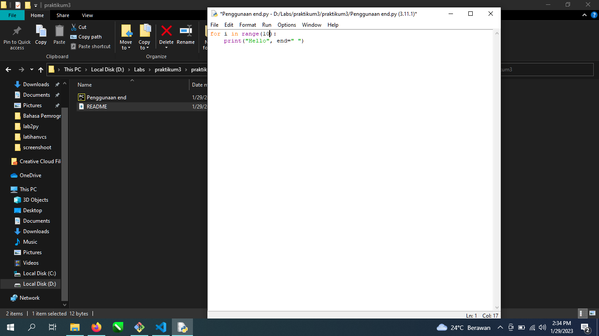

# praktikum3

Penggunaan perintah end pada phyton Dengan Mengetikan
for i in range(5):
    print("Hello", end=" ")
1[gambar2](screenshoot/ss2.png)
Perintah "end" digunakan untuk menentukan karakter yang akan ditambahkan setelah teks yang dicetak. Contoh di atas saya menentukan " " (spasi) sebagai karakter yang akan ditambahkan setelah setiap "Hello". Jika tidak menggunakan "end", maka setiap "Hello" akan dicetak pada baris baru.