# praktikum3

# Penggunaan perintah end pada phyton Dengan Mengetikan
for i in range(5):
    print("Hello", end=" ")
# Hasil Eksekusi
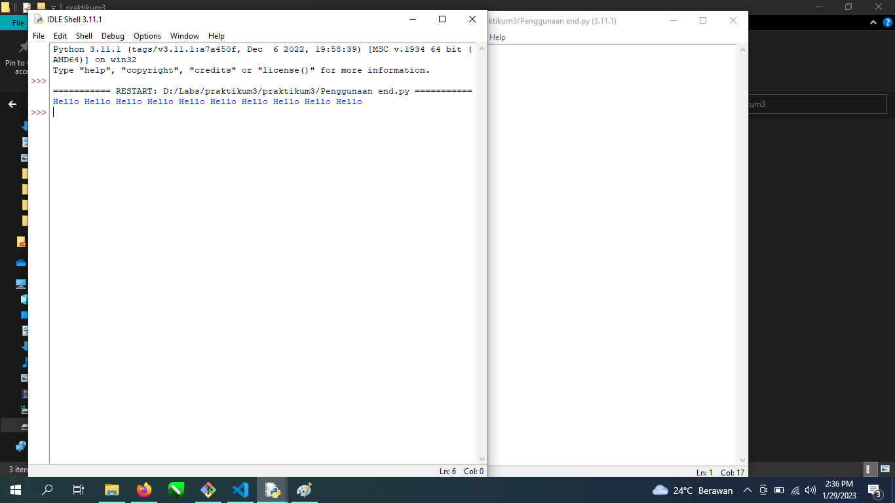
Perintah "end" digunakan untuk menentukan karakter yang akan ditambahkan setelah teks yang dicetak. Contoh di atas saya menentukan " " (spasi) sebagai karakter yang akan ditambahkan setelah setiap "Hello". Jika tidak menggunakan "end", maka setiap "Hello" akan dicetak pada baris baru.
# Penggunaan perintah sep pada phyton Dengan Mengetikan
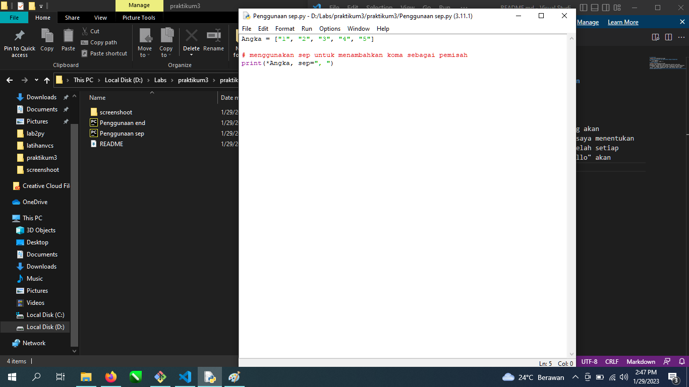
Angka = ["1", "2", "3", "4", "5"]
*menggunakan sep untuk menambahkan koma sebagai pemisah
print(*Angka, sep=", ")
# Hasil Eksekusi
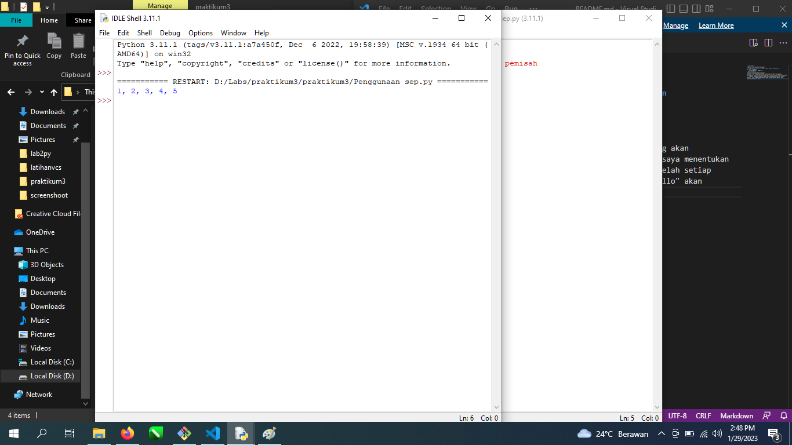
Perintah "sep" digunakan untuk menentukan karakter yang akan ditambahkan sebagai pemisah antar item dalam daftar. Dalam contoh di atas, saya menentukan ", " (koma dan spasi) sebagai pemisah antar item dalam daftar "Angka". Jika tidak menggunakan "sep", maka setiap item akan dicetak pada baris baru.
# Menginput variabel agar dapat dijumlahkan dengan mengetikkan
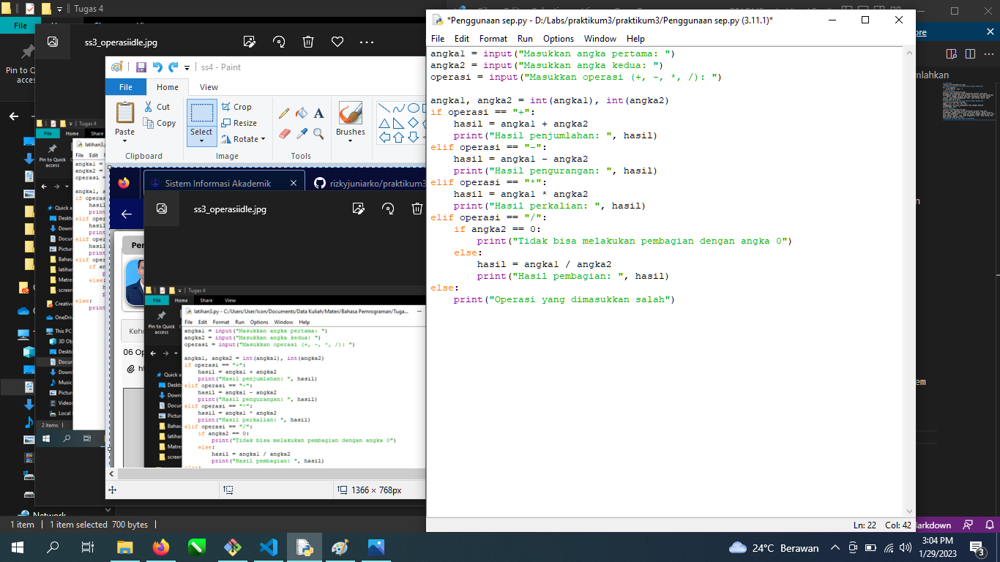
angka1 = input("Masukkan angka pertama: ")
angka2 = input("Masukkan angka kedua: ")
operasi = input("Masukkan operasi (+, -, *, /): ")

angka1, angka2 = int(angka1), int(angka2)
if operasi == "+":
    hasil = angka1 + angka2
    print("Hasil penjumlahan: ", hasil)
elif operasi == "-":
    hasil = angka1 - angka2
    print("Hasil pengurangan: ", hasil)
elif operasi == "*":
    hasil = angka1 * angka2
    print("Hasil perkalian: ", hasil)
elif operasi == "/":
    if angka2 == 0:
        print("Tidak bisa melakukan pembagian dengan angka 0")
    else:
        hasil = angka1 / angka2
        print("Hasil pembagian: ", hasil)
else:
    print("Operasi yang dimasukkan salah")
# Hasil Eksekusi
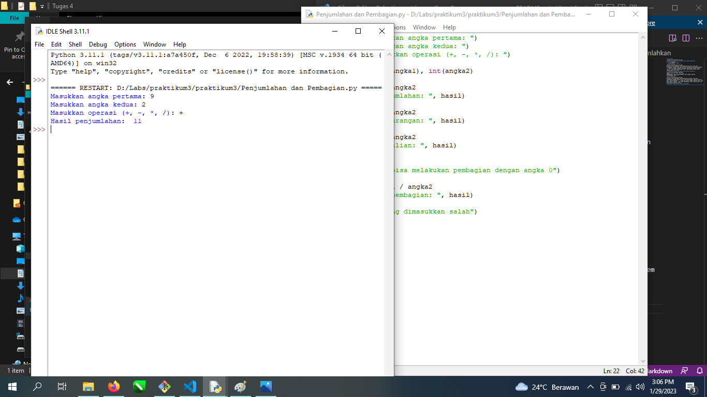
Masukan Input Varaibel Angka a dan b Berapa Saja maka akan muncul opsi mau dijumlahkan, pilih opsi makan akan muncul hasilnya

# Membuat format kode string membentuk diamond dengan mengetikkan
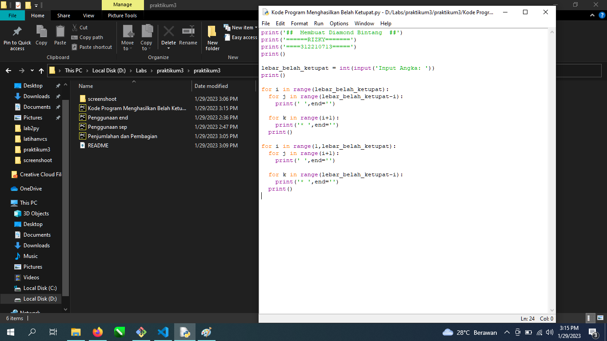
print('##  Membuat Diamond Bintang  ##')
print('======RIZKY=======')
print('====312210713=====')
print()
 
lebar_belah_ketupat = int(input('Input Angka: '))
print()
 
for i in range(lebar_belah_ketupat):
  for j in range(lebar_belah_ketupat-i):
    print(' ',end='')
     
  for k in range(i+1):
    print('* ',end='')
  print()

for i in range(1,lebar_belah_ketupat):
  for j in range(i+1):
    print(' ',end='')
     
  for k in range(lebar_belah_ketupat-i):
    print('* ',end='')
  print()
  # Input angka variabel maka akan muncul bintang bintang sesuai angka tersebut
  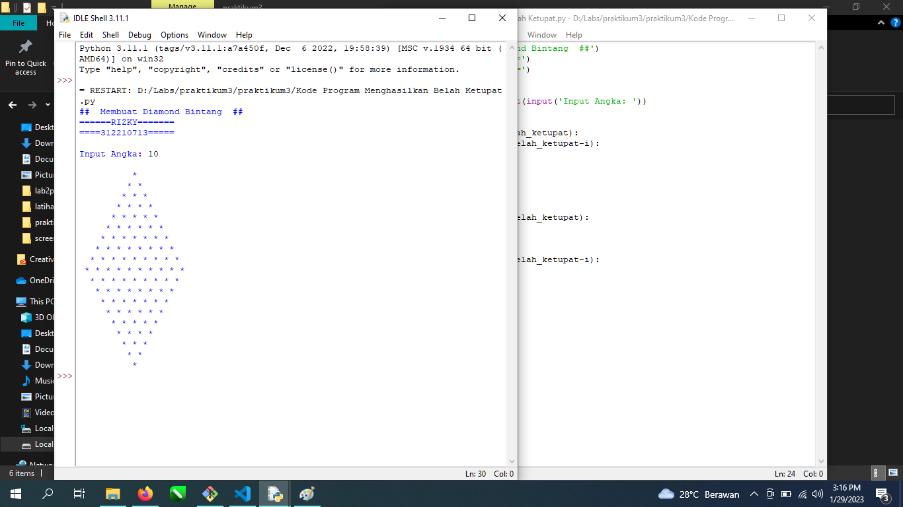

# Kode  program untuk menghitung luas dan keliling lingkaran menggunakan phycharm 

Berikut Algoritma Flowchartnya :
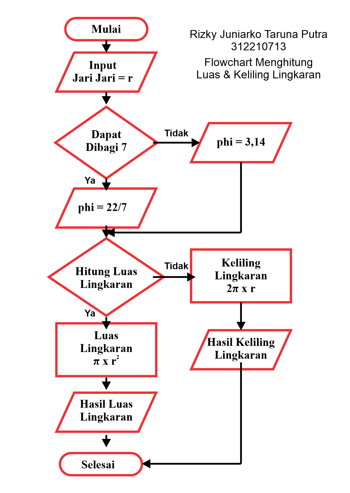
# Berikut Ketika di presentasikan menggunakan phycharm
r = input("Masukan Jari-Jari Lingkaran:")
pi = 3.14
l = pi * int(r) * int(r)
k = 2 * pi * int(r)
print("Luas Lingkaran:", l)
print("Kelililng Lingkaran:", k)
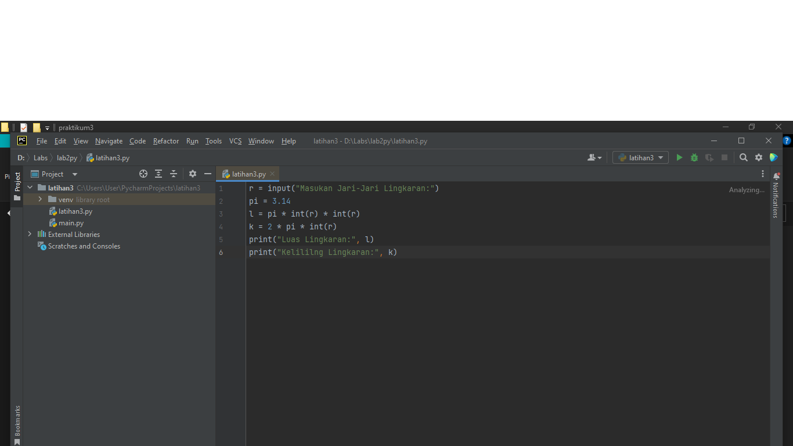
# Masukan Jari Jarin Lingkaran, Misal 8
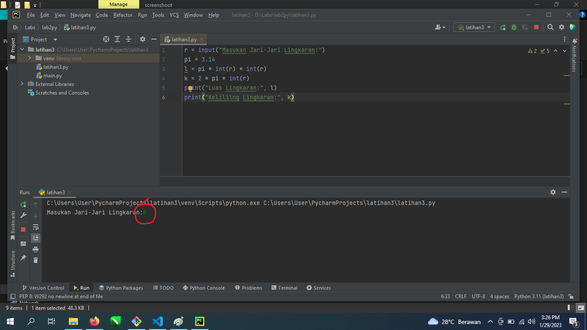
# Makan akan muncul hasilnya
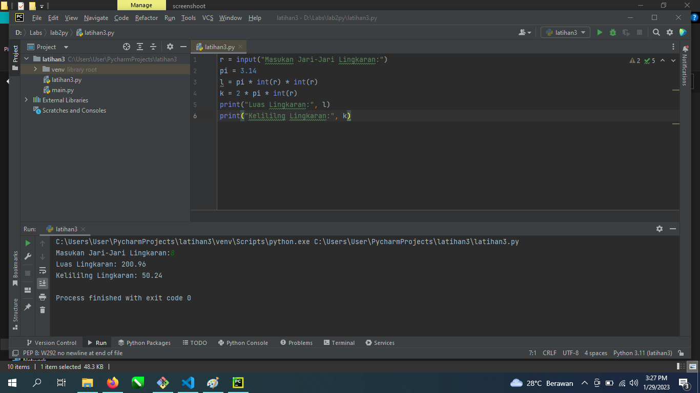

